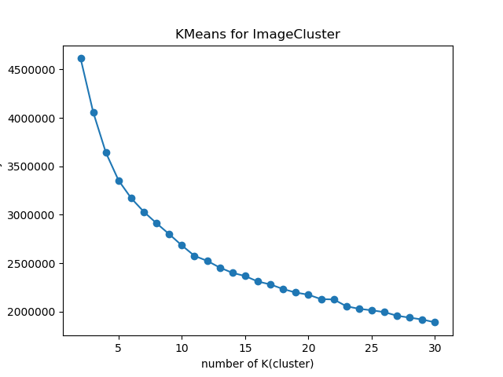
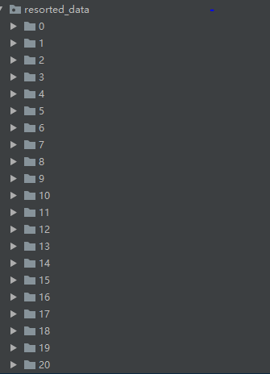

# ImageCluster
        
The `ImageCluster` project is aimed to cluster unlabeled images based on the SOTA models.  
It designed for engineers and students to fast feature maps and cluster the image according to your cluster-algo hyperparameter.  
This flow contains two main steps:  
1. Use SOTA pre-trained models(egs:VGG16,VGG19,ResNet50 ) on `imagenet` to extract feature maps.  
   You can choose the bone model and  resize the images(default size is (224,224)) as you like.  
2. Choose a clustering algorithm (eg: kmeans ) to label these feature maps. Therefore the images can be labeled to K classes.  
So,the data flow is shown as below  
Image->array->feature map->labeling(cluster algorithm)  
## Getting Started
### Installing
* system: win10/Ubuntu
* python:3.5+  
* Clone or download the repository  
* Commands to install requirements via Conda or pip wheels  
  `pip install -r requirements.txt`

### Usage
You can import this model script to your local the same-level python scripts.  
egs:
```
from model import ImageCluster
m=ImageCluster(
    base_model='vgg16',#your feature map extractor model
    resorted_img_folder='resorted_data',#the folder for clustered images
    cluster_algo='kmeans',#cluster algorithm
    maxK=30,#the max k num is 30, which means ImageCluster calculates every k in range(2,30+1)
)
#calculate the feature maps
m.get_feature_map(
    resize_shape=(224,224) # (w,h)  a tuple for resizing the input images to the same shape images
)
#clustering for feature maps
m.imagecluster()
```
```
Then, you can see the cluster sse value map, which draws a line shows each sse value for the k in range [2,maxK].  
Elbow criterion is applied to choose the best K for your cluster
```
<div align=center></div>

```
As we can see, 21 may be the best cluster number for this dataset.  
So,we can call the resorted_img function to label the images under different folders
```

```
m.resorted_img(
    selected_k_num=21# a int number in range[2,maxK]
)
```

```
In the end, the neatly arranged label folders and the image under these folders are shown below.  
```

<div align=center></div>

## Authors
* **Chris Li** - *all work*

## License
This project is licensed under the Apache License - see the [LICENSE](LICENSE) file for details
